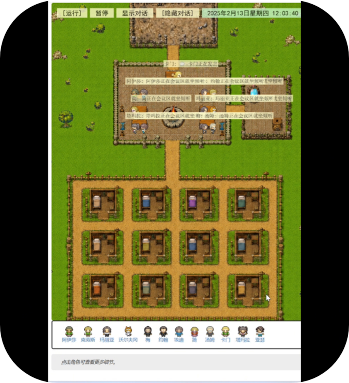
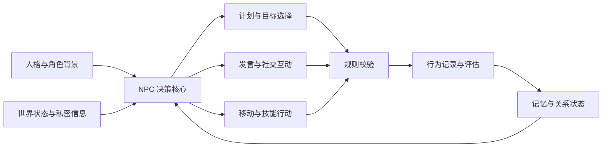
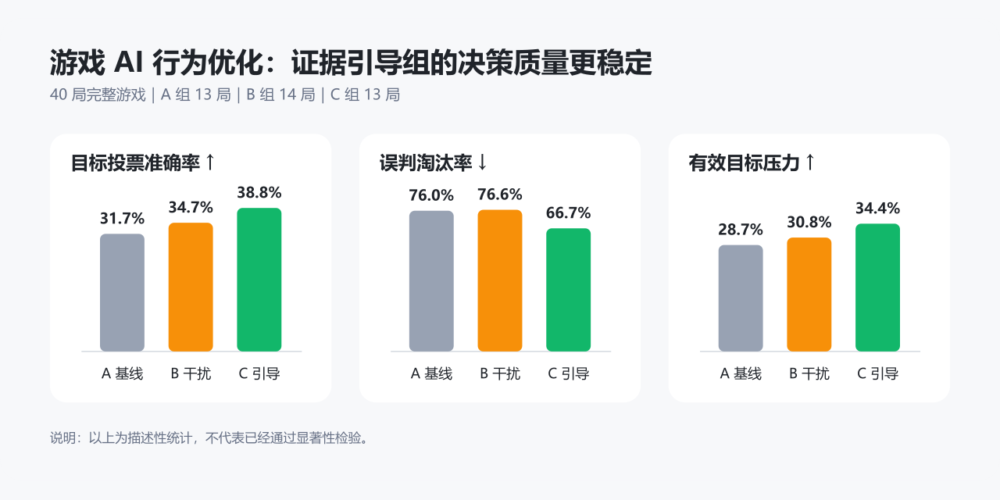

# Game AI Behavior Lab

## 面向游戏 NPC 的行为优化与评估平台

Game AI Behavior Lab 是一个基于大语言模型的多智能体游戏实验项目，重点研究：

> 如何让游戏 NPC 在复杂社交环境中表现得更有个性、更连贯、更可控，并且能够被游戏策划量化评估？

项目为 NPC 增加了人格背景、长期记忆、空间行动、身份权限、阶段目标和信息边界。狼人杀在本项目中只是测试场景，用于检验 NPC 在隐藏信息、阵营冲突、多人协作和动态决策条件下的行为质量。



## 项目解决的问题

| NPC 常见问题 | 优化方式 |
|---|---|
| 不同 NPC 的行为高度相似 | 使用独立人格、背景关系和行为倾向 |
| NPC 容易遗忘此前发生的事件 | 引入事件记忆、对话记忆、关系摘要和反思 |
| LLM 可能执行不符合规则的行为 | 使用阶段状态机、身份权限和候选目标校验 |
| NPC 决策效果难以衡量 | 记录发言、投票、推理、误判和胜负指标 |
| NPC 行为缺乏连续性 | 将日程、空间位置、当前状态与决策结合 |

## NPC 行为架构



一次完整的 NPC 决策包含：

1. 读取身份、阵营、人格和关系倾向。
2. 检索近期事件、历史对话和关键记忆。
3. 获取当前时间、位置、阶段和合法候选目标。
4. 根据角色目标生成行动或语言。
5. 通过程序规则检查行动是否合法。
6. 将结果写入记录，用于后续决策和实验分析。

## NPC 行为优化

### 人格与行为差异

NPC 人格不是一句静态人设，而是持续影响判断方式的行为条件。

当前包含三种主要原型：

- **强硬型**：更坚持已有立场，对特定群体保持较高警惕。
- **摇摆型**：容易受到局势和信息来源影响。
- **桥梁型**：倾向反对群体标签，把讨论引导回个人行为和证据。

人格会影响 NPC 的注意重点、语言风格、信任关系和目标选择，但不会直接指定行动结果。

### 记忆与行为连续性

NPC 可以记录和使用：

- 近期感知与公共事件；
- 历史对话和关系变化；
- 投票、死亡和身份信息；
- 当前日程、位置与行动；
- 对重要事件形成的反思结论。

这些信息会进入后续决策，减少 NPC 失忆、重复发言和立场无理由变化等问题。

### 身份驱动的阶段决策

系统将复杂游戏流程拆分为多个阶段：

- 夜间行动；
- 信息公布；
- 发言顺序协商；
- 顺序发言；
- 投票；
- 技能结算；
- 胜负判断。

NPC 只会获得符合自身身份的信息和合法行动范围。程序负责规则，LLM 负责表演、推理与选择。

### 行为记录与评估

项目会记录：

- NPC 发言内容和发言顺序；
- 投票选择与票型；
- 技能目标和行动结果；
- 角色死亡原因；
- 同群体防御和跨群体指控；
- 证据推理和群体标签的使用；
- 好人误放逐与狼人被放逐次数；
- 最终胜负和结束回合。

## A/B/C 对照实验

实验保持人物档案、角色计划和游戏规则一致，只改变 NPC 接收到的信息条件。

| 实验组 | 信息环境 | 设计目的 |
|---|---|---|
| A | 无额外干预 | 观察 NPC 的自然决策基线 |
| B | 分裂导向信息 | 观察偏见和群体标签是否放大错误判断 |
| C | 协作与证据导向信息 | 观察 NPC 是否更愿意依据行为证据修正判断 |

### 行为质量结果

<p align="center">
  
</p>

图中汇总了 40 局完整游戏（A 组 13 局、B 组 14 局、C 组 13 局）的描述性统计，比较三种信息条件下的目标投票准确率、误判淘汰率和有效目标压力。C 组在目标投票准确率和有效目标压力上最高，同时误判淘汰率最低，说明证据引导条件下的 NPC 决策质量更稳定。

### 指标小结

- **目标投票更准确**：C 组准确率为 38.8%，比 A 组提高 7.1 个百分点，比 B 组提高 4.1 个百分点。
- **关键误判更少**：C 组误判淘汰率降至 66.7%，比 A 组降低 9.3 个百分点，比 B 组降低 9.9 个百分点。
- **有效施压能力更强**：C 组有效目标压力达到 34.4%，比 A 组提高 5.7 个百分点，比 B 组提高 3.6 个百分点。

### 总体结论

在本次 40 局完整游戏中，证据引导不仅提高了 NPC 找准目标和持续施压的能力，也降低了导致错误淘汰的关键误判。相比之下，分裂导向干预虽然让 NPC 的投票准确率和施压能力略有上升，但没有改善误判淘汰率，说明“行为更积极”并不等于“决策质量更高”。对游戏 NPC 设计而言，更有效的优化方向不是单纯强化立场或对抗性，而是让角色围绕可验证证据更新判断，从而在保留人格差异的同时获得更稳定、更可信的群体行为。

以上结果属于描述性统计，用于展示行为趋势和评估方法，尚未经过显著性检验，不直接构成严格的因果结论。

## 主要代码

```text
generative_agents/
├─ modules/
│  ├─ agent.py                 # NPC 感知、计划、行动和反思
│  ├─ magic_mirror.py          # 阶段状态机、身份权限和规则裁决
│  ├─ werewolf_recorder.py     # 逐局、逐轮行为记录
│  ├─ fyp_stats.py             # NPC 行为指标和实验汇总
│  ├─ memory/                  # 记忆、日程和空间认知
│  └─ prompt/                  # NPC 决策提示模板
├─ data/
│  ├─ role_plans/              # 固定角色计划
│  └─ prompts/                 # 发言和目标选择模板
├─ frontend/                   # 地图与回放界面
├─ start.py                    # 单次模拟入口
└─ run_mirror_experiments.py   # A/B/C 批量实验入口
```

## 快速开始

1. 使用 Python 3.12 创建环境。
2. 执行 `pip install -r requirements.txt` 安装依赖。
3. 在 `generative_agents/data/config.json` 配置语言模型。
4. 进入 `generative_agents` 目录。
5. 执行：

```bash
python start.py --name npc-demo --start "20250213-09:30" --step 700 --stride 10 --mirror unity
```

运行 A/B/C 实验：

```bash
python run_mirror_experiments.py --base npc-eval-01 --lineage-mode two
```

启动回放：

```bash
python compress.py --name npc-demo
python replay.py
```

实验结果保存在本地 `generative_agents/results/`，不会上传至公开仓库。

## 后续计划

- 为所有实验加入统一随机种子。
- 补齐 A/B/C 等量有效局数。
- 增加情绪变化和关系网络可视化。
- 将词表统计升级为语义行为分类。
- 增加自动化 NPC 行为回归测试。
- 将行为系统应用到开放世界居民、阵营任务和互动叙事场景。

## 项目来源

本项目基于以下开源工作继续开发：

- [Generative Agents](https://github.com/joonspk-research/generative_agents)
- [wounderland](https://github.com/Archermmt/wounderland)
- [GenerativeAgentsCN](https://github.com/x-glacier/GenerativeAgentsCN)

基础项目提供虚拟小镇、生成式智能体和回放能力。本项目重点扩展游戏 NPC 的身份规则、人格条件、阶段行为、信息干预、批量实验和行为评估系统。

授权信息见 [LICENSE](LICENSE)。
